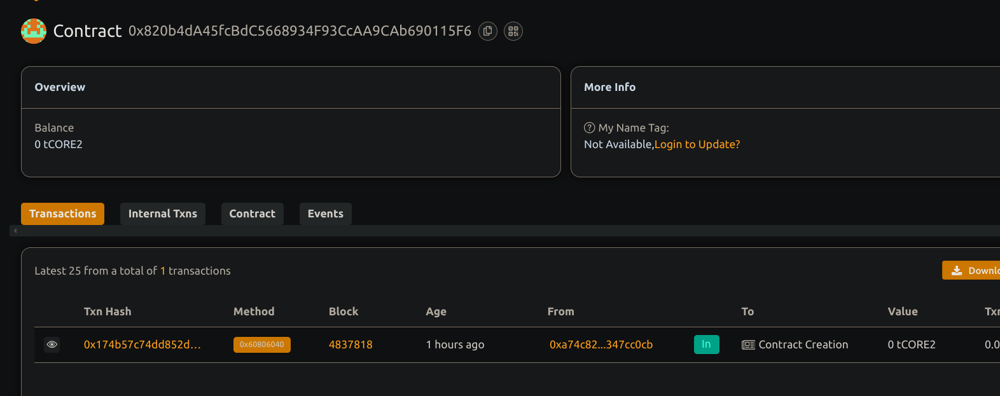

# 🆔 Decentralized Identity Verification System

## 📘 Project Description

A decentralized identity verification system for identity registration and verification where users can submit to personal metadata (e.g. documents) and authorized verifiers approve or reject this project.

## 🌍 Project Vision

Provide a trustless, transparent, and on-chain mechanism for any Project description identity registration version, identity authentication, reducing reliance on centralized KYC solutions for this.

## 🔑 Key Features

- Identity submission with name and metadata (IPFS-based)
- Status tracking: Pending, Verified or Rejected
- Verifier role with authority to approve/rejected
- Fully on chain records decentralized identity verification system

## 🚀 Future Scope

- Integration with off chain data oracles for document validation identity registration
- Decentralized reputation scores based on verification history of the project.
- DID (Decentralized Identifiers) and W3C compliance
- Integration with soulbound tokens or zkProofs decentralized identity verification system

## 📜 Deployment Instructions

```bash
npm install
npx hardhat compile
npx hardhat run scripts/deploy.js --network <your_network>
```

## Contract details
0x820b4dA45fcBdC5668934F93CcAA9CAb690115F6
